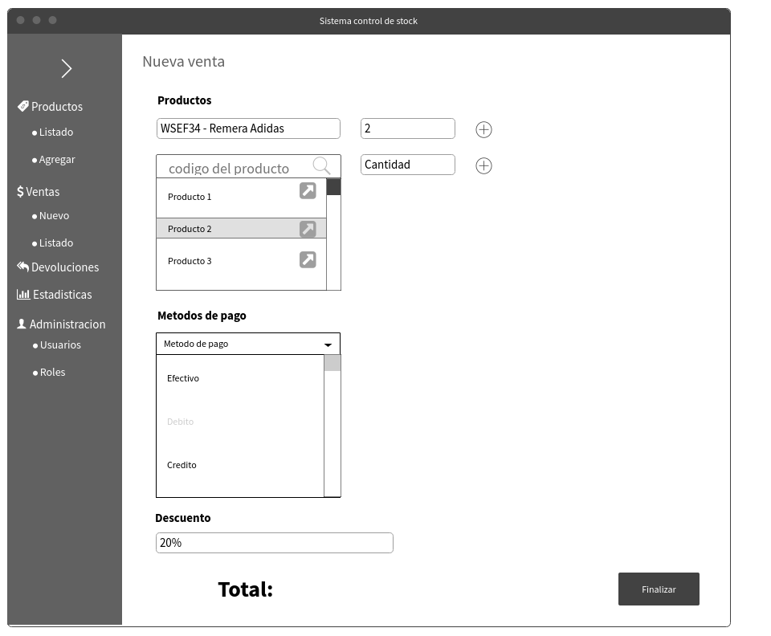

#Sistema de Control de Stock / Ventas
######Mayo 2019

Rocha, Matías  
Guilmezian, Daniel  

***
####Visión General
Sistema de control de stock para una tienda de ropa que permita administrar el ingreso y egreso de las prendas al local, teniendo un manejo de los proveedores, las ventas (con la posibilidad de devolución ó cambio de la prenda) y un apartado de estadísticas para visualizar de manera gráfica los movimientos del negocio.
  
  
###Especificaciones

**Carga de Productos**  
Se podrá cargar / eliminar / modificar productos teniendo en cuenta el manejo de proveedores. Cada producto tiene una categoría.  

**Manejo de Stock**  
Se podrá cargar / eliminar / modificar productos teniendo en cuenta el manejo de proveedores  

**Control de Ventas**    
Se podrá gestionar las ventas, con un módulo que permite:
Agregar ventas / editar con los siguientes datos: cod de producto, fecha, total, método de pago. Cada venta será identificada con un número de operación
Gestionar devoluciones: en caso de que haya una devolución, se agrega de nuevo el producto en stock  

**Comprobante de Venta**  
Generación de un recibo de venta detallando la compra hecha a modo de comprobante en caso de que haya una devolución luego.  

**Estadísticas**  
Interfaz estadística, que de manera visual y sencilla muestre entre otras cosas:  
+ Cantidad de ventas por mes
+ Tipo de operación por mes (tarjeta/efectivo/debito)
+ Total recaudado por mes

**Carga de Maestros**   
Se podrá cargar, editar y eliminar: Proveedores, Productos.  

**Usuarios**  
El sistema contará con un sistema de login de usuarios para poder ingresar al manejo del sistema. A su vez tendrán aplicado roles los cuales les darán o no acceso a determinados apartados de la aplicación.

**Administración**  
Se podrá dar de alta usuarios, y roles aplicados a estos.  

###Desarrollo

**Tecnologías**  
Para el desarrollo de la aplicación se usará php para el backend, basándose en el uso de Laravel como framework, y html, css y javascript puro para el front-end. Para el apartado de gráficos se hará uso de la librería:  
Se usará mysql como sistema gestor de base de datos.

###Pantallas

**Home**  

**Crear Venta**

**Estadísticas**
